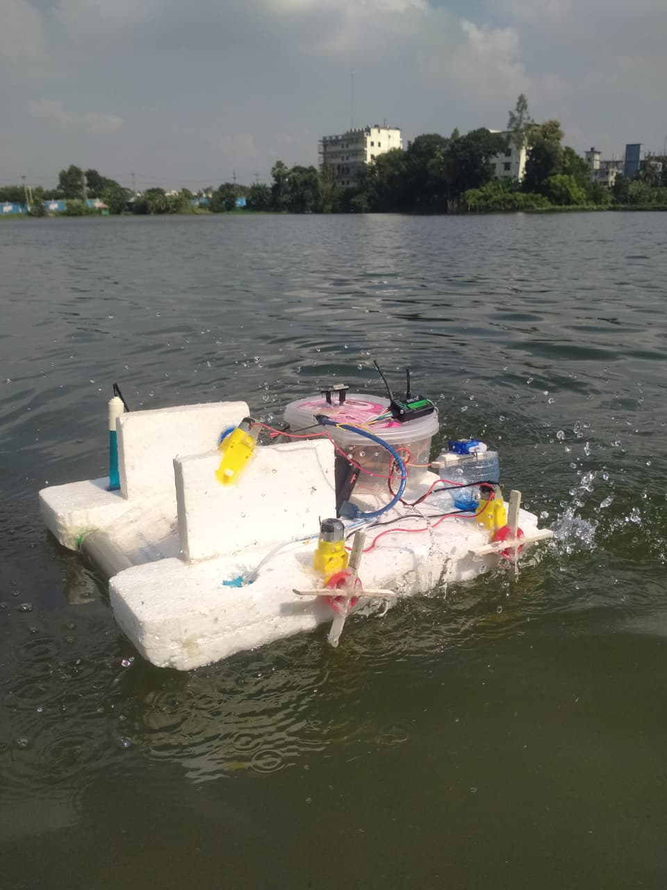
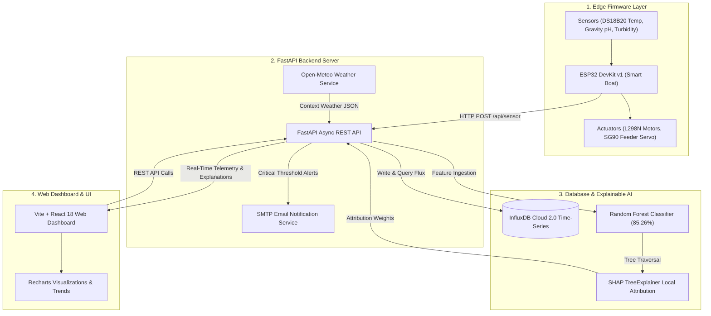
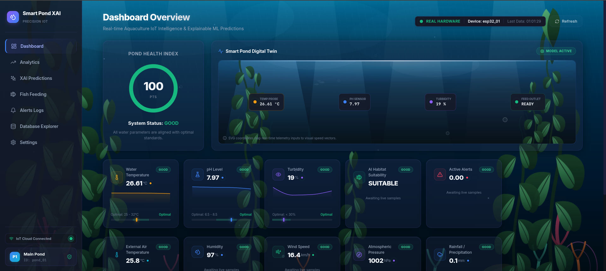
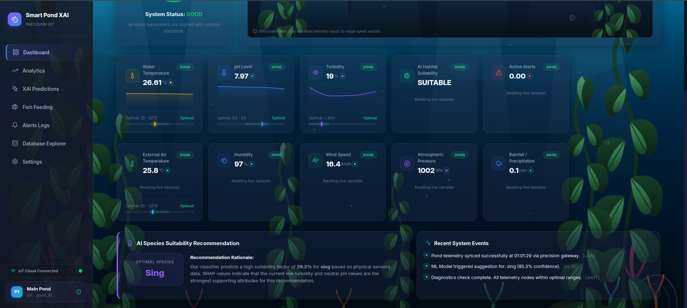
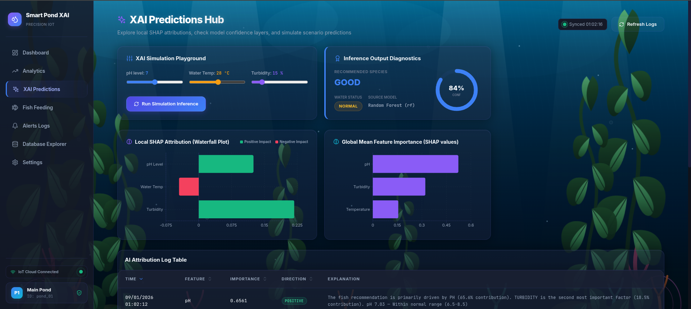
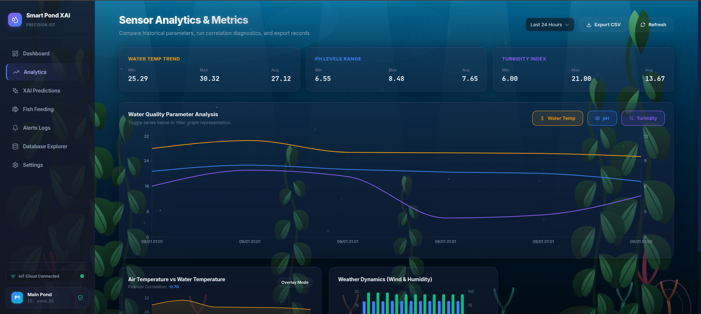
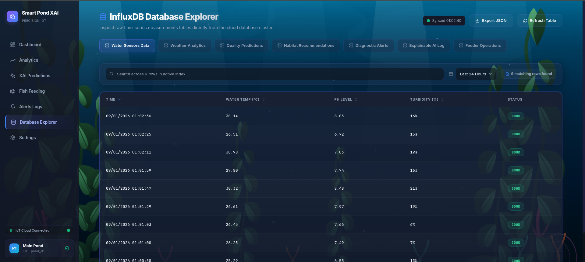

# An Explainable AI-Based Boat System for Intelligent Pond Management with LoRa Telemetry and Fish Habitat Suitability Prediction


<p align="center">
  
  
  
  
  
  
  
  
  
  
  
  
  
  
  
</p>

<p align="center">
  <b>An end-to-end IoT, Machine Learning, and Explainable AI (XAI) pond monitoring and fish habitat decision support platform powered by an autonomous ESP32 smart boat with long-range telemetry, InfluxDB Cloud time-series persistence, ensemble Random Forest models with local SHAP feature attributions, and a responsive React web dashboard.</b>
</p>

---

##  Table of Contents

- [Overview & Motivation](#overview--motivation)
- [Hardware Prototype & Smart Boat](#hardware-prototype--smart-boat)
- [System Architecture](#system-architecture)
- [Key Features](#key-features)
- [Visual Showcase & Screenshots](#visual-showcase--screenshots)
- [Hardware Specifications & Pinout](#hardware-specifications--pinout)
- [Sensor Calibration & Signal Conditioning](#sensor-calibration--signal-conditioning)
- [Machine Learning & Explainable AI (XAI)](#machine-learning--explainable-ai-xai)
- [Database Schema (InfluxDB Cloud)](#database-schema-influxdb-cloud)
- [REST API Reference](#rest-api-reference)
- [Sensor Simulator (Testing Without Hardware)](#sensor-simulator-testing-without-hardware)
- [Installation & Setup Guide](#installation--setup-guide)
- [Project Directory Structure](#project-directory-structure)
- [Known Difficulties, Bug Fixes & Engineering Lessons](#known-difficulties-bug-fixes--engineering-lessons)
- [System Limitations & Future Scope](#system-limitations--future-scope)
- [Author](#author)
- [License & Acknowledgments](#license--acknowledgments)

---

##  Overview & Motivation

Aquaculture plays a vital socio-economic role in South Asia (particularly Bangladesh and India), providing food security, protein supply, and rural employment. However, smallholder fish farmers frequently suffer severe financial losses caused by sudden, unnoticed water quality deterioration (e.g., rapid pH drops, water temperature spikes, and high turbidity). Commercial monitoring buoys and industrial aquaculture probes ($300–$1,000+) are cost-prohibitive for resource-constrained farmers, lack automated decision support, and offer zero explainability for recommended interventions.

**Smart Pond XAI** addresses this critical gap by providing a low-cost (~$40) autonomous IoT smart boat paired with a cloud-native Machine Learning and Explainable AI (XAI) decision-support platform:
1. **Real-time Surface Telemetry:** Ingests water temperature, pH, and turbidity continuously from an autonomous smart boat navigating the pond.
2. **Context-Aware Decision Support:** Fuses localized weather parameters (ambient temperature, humidity, rainfall, pressure) with pond telemetry.
3. **Machine Learning Habitat Predictions:** Uses an ensemble Random Forest model trained across 11 major commercial fish species to predict habitat suitability with **85.26% test accuracy**.
4. **Transparent Explainable AI (XAI):** Employs **SHAP (SHapley Additive exPlanations)** `TreeExplainer` to calculate local feature attributions, explaining *why* a specific species or water intervention is recommended.
5. **Automated Actuation & Alerts:** Includes an automated SG90 servo fish food dispenser, safety interlocks that block feeding during poor water quality, and automated SMTP email alerts for critical parameter violations.

---

##  Hardware Prototype & Smart Boat

The physical data collection unit is an autonomous, lightweight catamaran-style smart boat designed for aquatic stability and modular sensor deployment.

<p align="center">
  
  <br>
  <em>Figure 1: Smart Pond XAI Autonomous Smart Boat Prototype showing ESP32 DevKit, twin DC motor propulsion, SG90 servo feeder, and waterproof multi-sensor array.</em>
</p>

### Key Physical Characteristics
* **Autonomous & Remote Propulsion:** Twin DC motors driven by an L298N dual H-bridge motor driver module for directional thrust and steering.
* **Automated Food Dispenser:** Integrated top-mounted feeder compartment with an SG90 micro-servo motor acting as a calibrated dispensing hatch.
* **Submersible Multi-Sensor Array:** DS18B20 waterproof digital temperature probe, DFRobot Gravity Analog pH probe V2, and DFRobot optical turbidity sensor.
* **Wireless Telemetry Pipeline:** ESP-WROOM-32 Wi-Fi module establishing auto-reconnecting HTTP client sessions to publish JSON telemetry packets directly to the cloud backend.

---

##  System Architecture

The system is built on a decoupled, 4-tier architecture spanning Edge Firmware, Cloud Backend, ML/XAI Analytics, and Responsive Web Presentation.



### Data Pipeline Flow
1. **Telemetry Sampling:** ESP32 samples DS18B20 (OneWire), pH (12-bit ADC with 50-sample moving average), and Turbidity (ADC) every 10–30 seconds.
2. **Edge Ingestion:** Telemetry packet is POSTed to `/api/sensor` on the FastAPI server over HTTP/HTTPS.
3. **Storage & Validation:** FastAPI validates incoming payloads using Pydantic, applies threshold heuristics (`GOOD`, `MODERATE`, `POOR`), and commits points to InfluxDB Cloud via `write_api`.
4. **Context Enrichment:** Backend concurrently retrieves localized meteorological metrics (temperature, humidity, atmospheric pressure, precipitation) from Open-Meteo.
5. **Inference & Explanation:** When triggered manually or automatically, the Random Forest model determines fish habitat suitability and the SHAP `TreeExplainer` computes exact percentage contributions for pH, temperature, and turbidity.
6. **Alert Dispatch:** If water status degrades to `POOR` or `MODERATE`, the SMTP alert service delivers instant notification emails with root-cause diagnoses.
7. **Presentation:** The React dashboard polls `/api/dashboard`, `/api/history`, `/api/xai`, and `/api/feeding`, rendering live gauge cards, interactive time-series charts, and SHAP waterfall explainers.

---

## ⚡ Key Features

| Domain | Feature | Description |
| :--- | :--- | :--- |
| **IoT Telemetry** | Multi-Sensor Monitoring | Continuous monitoring of pH (0–14), Water Temp (-55°C to 125°C), and Turbidity (0–100 clarity index). |
| **IoT Firmware** | Smart Navigation & OTA | Motor propulsion, BLE navigation backup, Wi-Fi auto-reconnect, and Over-The-Air (OTA) firmware update support. |
| **Machine Learning** | Fish Species Suitability | Random Forest classification predicting ideal pond habitats for 11 regional fish species with 85.26% accuracy. |
| **Explainable AI** | SHAP Local Explanations | Real-time feature attribution quantifying exact positive/negative impact percentages for every prediction. |
| **Automated Feeding** | Smart Feeder Control | Scheduled (e.g. every 9 hours) or manual food dispensing with safety interlocks preventing feeding during poor water quality. |
| **Proactive Alerts** | Multi-Threshold Email Alerting | Automated SMTP notifications on water quality degradation with cooldown timers and recovery confirmations. |
| **Interactive UI** | Precision Web Dashboard | Real-time sensor gauges, 24h/7d time-series trends, historical data tables, and interactive XAI diagnostic panels. |
| **Simulated Testing** | Zero-Hardware Simulator | Built-in `simulate_sensor.py` daemon enabling end-to-end cloud and UI testing without physical hardware. |

---

##  Visual Showcase & Screenshots

### 1. Real-Time Precision Aquaculture Monitoring Dashboard
The primary dashboard presents real-time telemetry metrics, environmental health status badges, interactive Recharts trend graphs, and integrated weather forecasting.

<p align="center">
  
  <br>
  <em>Figure 2: Real-time telemetry monitoring displaying live pH, temperature, turbidity, localized weather, and feeding countdowns.</em>
</p>

---

### 2. Comprehensive Telemetry & System Analytics View
Extended telemetry view showcasing sensor status breakdowns, historical parameter logs, and multi-metric time-series curves.

<p align="center">
  
  <br>
  <em>Figure 3: System overview displaying historical trend lines, device operational state, and parameter health distributions.</em>
</p>

---

### 3. Explainable AI (XAI) — SHAP Feature Attribution Interface
The XAI diagnostics page provides transparency by displaying feature importance percentages, parameter influence direction, and automated natural-language decision rationales.

<p align="center">
  
  <br>
  <em>Figure 4: SHAP TreeExplainer interface showing feature contribution breakdown (pH, Temperature, Turbidity) for fish habitat recommendations.</em>
</p>

---

### 4. Machine Learning Habitat Analytics & Fish Species Recommendation
Detailed analytics interface enabling farmers to test custom water parameters or run automated habitat suitability checks across 11 fish species.

<p align="center">
  
  <br>
  <em>Figure 5: Species suitability analytics showing model confidence scores, environmental tolerance envelopes, and historical recommendations.</em>
</p>

---

### 5. InfluxDB Time-Series Telemetry & Query Explorer
Raw time-series database management console showing indexed IoT records, timestamped sensor events, and Flux query results.

<p align="center">
  
  <br>
  <em>Figure 6: Database explorer displaying high-frequency time-series tables, bucket retention statistics, and exportable log data.</em>
</p>

---

##  Hardware Specifications & Pinout

| Component | Model / Specification | ESP32 Pin | Interface / Protocol | Functionality / Details |
| :--- | :--- | :--- | :--- | :--- |
| **Microcontroller** | ESP32 DevKit v1 (ESP-WROOM-32) | — | Micro-USB / 3.3V Logic | 240 MHz dual-core, 520 KB SRAM, 4 MB Flash, Wi-Fi 802.11 b/g/n |
| **Water Temperature** | DS18B20 Waterproof Probe | GPIO4 (`TEMP_PIN`) | OneWire (DallasTemp) | Range: -55°C to +125°C, ±0.5°C accuracy (requires 4.7kΩ pull-up) |
| **Analog pH Sensor** | DFRobot Gravity Analog pH Kit V2 | GPIO35 (`PH_PIN`) | 12-Bit Analog ADC | 0.0 to 14.0 pH range, two-point linear buffer calibrated |
| **Turbidity Sensor** | DFRobot SEN0189 Optical Sensor | GPIO34 (`TURB_PIN`) | 12-Bit Analog ADC | Qualitative light attenuation index (0 = clear, 100 = turbid) |
| **Motor Driver** | L298N Dual H-Bridge Driver | GPIO27, 26, 25, 33, 14, 12, 13, 15 | Digital GPIO Output | Controls twin DC propulsion motors for forward, reverse, and turning |
| **Feeder Actuator** | SG90 9g Micro Servo Motor | GPIO18 (`SERVO_PIN`) | 50Hz PWM Output | Actuates food dispenser door: 0° (Closed) to 90° (Dispense) |

---

##  Sensor Calibration & Signal Conditioning

### 1. pH Sensor Calibration (Two-Point Linear Calibration)
The DFRobot Gravity pH V2 sensor outputs analog voltage inversely proportional to acidity. In firmware (`firmware/ESP32_BOAT/sensors.h`), 50 consecutive analog samples are averaged to eliminate high-frequency ripple:

$$\text{Voltage} = \overline{\text{ADC}} \times \left(\frac{3.30\text{V}}{4095.0}\right)$$

Using standard reference buffer solutions ($\text{pH } 4.00 @ 2.90\text{V}$ and $\text{pH } 7.00 @ 2.50\text{V}$):

$$\text{Slope} = \frac{7.00 - 4.00}{V_{\text{pH } 7} - V_{\text{pH } 4}} = \frac{3.00}{2.50\text{V} - 2.90\text{V}} = -7.50\text{ pH/V}$$

$$\text{pH} = 7.00 + \text{Slope} \times (\text{Voltage} - V_{\text{pH } 7})$$

$$\text{pH}_{\text{final}} = \text{clamp}(\text{pH}, 0.0, 14.0)$$

### 2. Temperature Signal Conditioning
The DS18B20 sensor communicates over a single digital pin using Dallas Semiconductor's OneWire protocol. The firmware incorporates fault-detection logic: if the probe is disconnected, it returns $-127.0^\circ\text{C}$ or $-1.0^\circ\text{C}$, triggering sensor-disconnect flags without corrupting InfluxDB analytics.

### 3. Turbidity Clarity Index
The analog turbidity sensor measures optical light transmission through the water column. The raw ADC values (1500 to 3500) are conditioned into a normalized clarity index scale (0% = perfectly clear, 100% = heavily turbid).

---

##  Machine Learning & Explainable AI (XAI)

### 1. Multi-Class Fish Habitat Suitability Model
* **Classifier:** Scikit-Learn Random Forest Classifier (`n_estimators=300`, `max_depth=15`, `random_state=42`).
* **Test Accuracy:** **85.26%** with Stratified 80/20 train/test evaluation.
* **Input Features ($d=3$):** `ph`, `temperature`, `turbidity`.
* **Target Classes (11 Species):**
  1. Carp (`karpio`)
  2. Catla (`katla`)
  3. Koi (`koi`)
  4. Walking Catfish (`magur`)
  5. Pangas (`pangas`)
  6. Freshwater Prawn (`prawn`)
  7. Rohu (`rui`)
  8. Tiger Shrimp (`shrimp`)
  9. Silver Carp (`silverCup`)
  10. Stinging Catfish (`sing`)
  11. Tilapia (`tilapia`)

### 2. Data Augmentation Pipeline (`ml/train.py`)
To prevent overfitting on 287 baseline biological field records (`ml/data/raw/pond_dataset.csv`), a **50x Gaussian Noise Augmentation pipeline** was implemented:

$$\text{pH}_{\text{aug}} = \text{clip}\left(\text{pH} + \mathcal{N}(0, \sigma=0.05), 0, 14\right)$$

$$\text{Temp}_{\text{aug}} = \text{clip}\left(\text{Temp} + \mathcal{N}(0, \sigma=0.30), 0, 50\right)$$

$$\text{Turb}_{\text{aug}} = \text{clip}\left(\text{Turb} + \mathcal{N}(0, \sigma=0.20), 0, 100\right)$$

* **Total Dataset Size:** **14,350 records** (11,480 training samples, 2,870 test samples).

### 3. Explainable AI via SHAP (`TreeExplainer`)
Black-box ML predictions are unsafe for agricultural decisions. Smart Pond XAI integrates SHAP to compute exact game-theoretic Shapley values:

$$\phi_i(f, x) = \sum_{S \subseteq F \setminus \{i\}} \frac{|S|!(|F| - |S| - 1)!}{|F|!} \left[ f_x(S \cup \{i\}) - f_x(S) \right]$$

For every inference, the SHAP engine calculates the exact percentage weight of `ph`, `temperature`, and `turbidity`, generating natural-language explanations (e.g. *"The shrimp recommendation is primarily driven by pH (47.1% contribution), while temperature is within optimal range"*).

---

##  Database Schema (InfluxDB Cloud)

InfluxDB Cloud 2.0 acts as the dedicated time-series repository using tag-indexed retention:

| Measurement Name | Tag Keys | Field Keys | Purpose |
| :--- | :--- | :--- | :--- |
| `water_sensor_data` | `pond_id`, `device_id`, `status` | `water_temperature` (float), `ph` (float), `turbidity` (int) | Real-time IoT sensor readings from ESP32 or simulator |
| `weather_data` | `pond_id` | `air_temperature` (float), `humidity` (float), `rainfall` (float), `wind_speed` (float), `pressure` (float) | Localized meteorological context from Open-Meteo |
| `fish_habitat_prediction`| `pond_id`, `model_version` | `habitat_status` (str), `recommended_fish` (str), `confidence_score` (float) | ML species suitability predictions |
| `xai_explanations` | `pond_id`, `model_version`, `top_feature` | `ph_importance` (float), `temperature_importance` (float), `turbidity_importance` (float), `interpretation` (str) | SHAP local attribution metrics |
| `feeding_logs` | `pond_id`, `feeding_mode` | `feeding_status` (str), `duration_seconds` (int), `reason` (str) | Automated/Manual fish feeding event records |
| `alerts` | `pond_id`, `alert_type`, `severity` | `message` (str), `resolved` (bool) | Water degradation & parameter violation alert logs |

---

##  REST API Reference

**Base URL:** `http://127.0.0.1:8000/api` (Production: `https://smart-pond-api.onrender.com/api`)  
**Interactive Swagger Docs:** `http://127.0.0.1:8000/docs`

### Ingestion & Telemetry Endpoints
* `POST /api/sensor` — Ingest sensor payload from ESP32 or Simulator.
* `GET /api/dashboard` — Aggregates latest sensor readings, weather, and system alert summary.
* `GET /api/history?hours=N` — Retrieves historical time-series sensor points ($N \le 168\text{ hrs}$).
* `GET /api/status` — Returns lightweight water status (`GOOD`, `MODERATE`, `POOR`, `UNKNOWN`).

### Machine Learning & XAI Endpoints
* `POST /api/predict` — Computes fish species suitability and SHAP feature attribution for custom input values.
* `POST /api/predict/auto` — Runs inference automatically using the latest live InfluxDB sensor values.
* `GET /api/predict/latest` — Returns the most recent ML prediction and confidence score.
* `GET /api/xai?hours=N` — Fetches historical SHAP explanation attributions.

### Feeding & Actuation Endpoints
* `POST /api/feed` — Dispatches feeding actuation (automatically rejected if water quality is `POOR`).
* `GET /api/feed/status` — Fetches feeding status, daily feed count, and last feeding timestamp.
* `GET /api/feeding?hours=N` — Retrieves historical feeding logs.

### Sample API Payload & Response (`POST /api/predict`)

**Request Payload:**
```json
{
  "ph": 7.8,
  "temperature": 28.5,
  "turbidity": 12
}
```

**Response Payload:**
```json
{
  "recommended_fish": "shrimp",
  "confidence_score": 0.8526,
  "water_quality": "GOOD",
  "habitat_status": "SUITABLE",
  "shap_explanation": {
    "top_feature": "ph",
    "feature_importance": {
      "ph": 0.4709,
      "temperature": 0.2719,
      "turbidity": 0.2572
    },
    "explanation_type": "shap_tree_explainer",
    "interpretation": "The fish recommendation is primarily driven by PH (47.1% contribution). TEMPERATURE is the second most important factor (27.2% contribution). pH 7.80 — Within normal range (6.5-8.5)."
  }
}
```

---

##  Sensor Simulator (Testing Without Hardware)

The repository includes a dedicated sensor simulation daemon (`simulate_sensor.py`) allowing full local and cloud testing without a physical ESP32 connected.

```bash
# 1. Send a single realistic reading with ML prediction:
python simulate_sensor.py --predict

# 2. Run continuous background simulation (sends reading every 10 seconds):
python simulate_sensor.py --continuous --interval 10 --predict

# 3. Simulate severe water degradation (POOR quality) to test SMTP alerts:
python simulate_sensor.py --status POOR --predict

# 4. Send a custom parameter combination:
python simulate_sensor.py --ph 7.4 --temp 29.0 --turbidity 15 --predict
```

> **Seamless Transition to Real Hardware:** The simulator sends data to the exact same endpoint (`POST /api/sensor`) as the ESP32. When powering on the physical ESP32, simply stop the simulator (`Ctrl+C`); no backend or dashboard configuration changes are required!

---

##  Installation & Setup Guide

### 1. Prerequisites
* **Python 3.10+** (Tested on Python 3.10–3.14)
* **Node.js 18+** & **npm**
* **InfluxDB Cloud Account** (Free tier)
* **Arduino IDE** (For flashing ESP32)

---

### 2. Backend Setup (FastAPI)

```bash
# Clone the repository
git clone https://github.com/Masud744/smart-pond-xai.git
cd smart-pond-xai

# Create and activate Python virtual environment
python3 -m venv venv
source venv/bin/activate       # Linux/macOS
# venv\Scripts\activate        # Windows

# Install Python dependencies
pip install -r requirements.txt

# Create .env configuration file
cp .env.example .env
```

Edit `.env` with your credentials:
```env
PORT=8000
DEVICE_ID=esp32_01
POND_ID=pond_01

# InfluxDB Cloud Credentials
INFLUXDB_URL=https://us-east-1-1.aws.cloud2.influxdata.com
INFLUXDB_TOKEN=your_influxdb_token_here
INFLUXDB_ORG=your_org_name
INFLUXDB_BUCKET=smart_pond_db

# Open-Meteo Weather Location
WEATHER_LATITUDE=24.07
WEATHER_LONGITUDE=90.22

# Email Alerts (SMTP)
EMAIL_ENABLED=false
EMAIL_HOST=smtp.gmail.com
EMAIL_PORT=587
EMAIL_USER=your_email@gmail.com
EMAIL_PASSWORD=your_app_password
EMAIL_FROM=your_email@gmail.com
EMAIL_TO=recipient_email@gmail.com
```

Start the backend server:
```bash
python3 -m uvicorn app.main:app --host 0.0.0.0 --port 8000 --reload
```

---

### 3. Frontend Setup (React + Vite)

```bash
# Navigate to frontend folder
cd frontend-react

# Install Node dependencies
npm install

# Create frontend .env file
echo "VITE_API_BASE=http://127.0.0.1:8000/api" > .env

# Start Vite development server
npm run dev
```
Open **[http://localhost:5173](http://localhost:5173)** in your browser.

---

### 4. Firmware Flashing (ESP32)
1. Open `firmware/ESP32_BOAT/ESP32_BOAT.ino` in the Arduino IDE.
2. Install required libraries via Library Manager: `OneWire`, `DallasTemperature`, `ESP32Servo`, `ArduinoJson`.
3. Update your Wi-Fi SSID, Password, and Backend URL in `firmware/ESP32_BOAT/config.h`.
4. Select board **ESP32 Dev Module** and flash via USB.

---

##  Project Directory Structure

```
smart-pond-xai/
├── app/                              # FastAPI Backend Application Layer
│   ├── config.py                     # App settings, environment vars & thresholds
│   ├── main.py                       # FastAPI entry point, CORS & router registrations
│   ├── models/
│   │   └── schemas.py                # Pydantic schemas for data validation
│   ├── routes/
│   │   ├── dashboard.py              # /api/dashboard, /api/history, /api/status
│   │   ├── feeding.py                # /api/feed, /api/feed/status, /api/feeding
│   │   ├── ota.py                    # /api/ota/version, /api/ota/firmware
│   │   ├── prediction.py             # /api/predict, /api/predict/auto, /api/predict/latest
│   │   └── sensor.py                 # /api/sensor ingestion endpoint
│   └── services/
│       ├── alert_service.py          # SMTP notification dispatcher with deduplication
│       ├── influx_service.py         # InfluxDB time-series queries (Flux) & persistence
│       ├── ml_service.py             # Random Forest loader & inference engine
│       ├── shap_service.py           # SHAP TreeExplainer local feature attribution
│       └── weather_service.py        # Open-Meteo weather API client
│
├── firmware/
│   └── ESP32_BOAT/                   # ESP32 C++ (Arduino Core) Firmware
│       ├── ESP32_BOAT.ino            # Main setup and loop
│       ├── bluetooth.h               # Bluetooth serial manual navigation
│       ├── config.h                  # Wi-Fi credentials, pin mapping & thresholds
│       ├── data_sender.h             # Async HTTP client telemetry dispatcher
│       ├── motors.h                  # L298N DC motor driver controls
│       ├── ota_update.h              # Firmware over-the-air updater
│       ├── sensors.h                 # Sensor signal conditioning & calibration
│       ├── servo_control.h           # SG90 feeder servo hatch actuation
│       └── wifi_manager.h            # Wi-Fi auto-connect & reconnect handler
│
├── frontend-react/                   # Vite + React 18 Web Dashboard
│   ├── src/
│   │   ├── App.jsx                   # React Router route definitions
│   │   ├── components/               # Layout, Navigation, DataTable, Digital Twin
│   │   ├── pages/                    # Dashboard, XAI, Analytics, Feeding, Settings
│   │   └── services/api.js           # Axios/Fetch API client wrapper
│   ├── package.json                  # Frontend dependencies (Recharts, Lucide, Tailwind)
│   └── vite.config.js                # Vite build configuration
│
├── ml/                               # Machine Learning & XAI Training Pipeline
│   ├── data/raw/pond_dataset.csv     # Baseline aquaculture habitat records
│   ├── models/                       # Serialized model weights (*.pkl) & scaler
│   │   ├── rf_model.pkl              # Random Forest Classifier (85.26%)
│   │   ├── dt_model.pkl              # Decision Tree Classifier
│   │   ├── svm_model.pkl             # Support Vector Machine Classifier
│   │   └── scaler.pkl                # Standard Scaler
│   ├── train.py                      # 50x Gaussian noise augmented training pipeline
│   └── predict.py                    # Standalone CLI prediction script
│
├── Images/                           # Project screenshots, prototype & visual assets
├── requirements.txt                  # Python dependencies
├── render.yaml                       # Cloud deployment blueprint
├── Dockerfile                        # Containerization specification
└── .env.example                      # Environment variables template
```

---

##  Known Difficulties, Bug Fixes & Engineering Lessons

During the engineering and integration of the Smart Pond XAI system, several complex hardware, firmware, and cloud bugs were encountered and resolved:

### 1. pH Calibration Formula Sign Inversion
* **Issue:** Acidic voltages ($2.90\text{V}$) were evaluating as basic pH ($>10.0$).
* **Root Cause:** DFRobot Gravity analog pH probes output higher voltage for acidic solutions. The denominator subtraction order in the slope formula was inverted as `(4.0 - 7.0)` instead of `(PH_CAL_VOLTAGE_7 - PH_CAL_VOLTAGE_4)`.
* **Resolution:** Re-derived the two-point linear slope:
  $$\text{Slope} = \frac{7.00 - 4.00}{V_7 - V_4} = \frac{3.00}{2.50 - 2.90} = -7.50$$
  Implemented correct clamp logic ensuring robust $0.0–14.0$ bounds.

### 2. DS18B20 Disconnect Handling in Water Quality Heuristics
* **Issue:** When the temperature probe was disconnected, the system returned $-1.0^\circ\text{C}$ or $-127.0^\circ\text{C}$, but was incorrectly classified as `MODERATE` status if pH was normal.
* **Resolution:** Added explicit non-negative temperature boundary checks:
  `bool tempMod = (temp >= 15.0 && temp <= 38.0 && temp != -1.0);`.

### 3. BluetoothSerial + HTTPS SSL Heap Memory Fragmentation
* **Issue:** Running classic `BluetoothSerial` alongside `WiFiClientSecure` caused ESP32 SSL handshake failures (`-32512 SSL Memory allocation failed`), despite having $>40\text{KB}$ free heap.
* **Root Cause:** Memory heap fragmentation prevented contiguous $16\text{KB}$ SSL buffer allocation.
* **Resolution:** Temporarily release Bluetooth memory buffers during HTTP transmission windows, or switch to lightweight HTTP when operating on secure local networks.

### 4. Alert Cooldown & State Persistence
* **Issue:** An in-memory global `last_alerted_status` variable suppressed alerts during continuous 90-minute degradation events and caused alert spam on server restarts.
* **Resolution:** Replaced in-memory states with InfluxDB-backed alert history querying (`get_latest_alert()`) combined with a 15-minute reminder cooldown timer for unresolved `POOR` status events.

### 5. InfluxDB Relative Time Range Queries
* **Issue:** Querying "Last 7 Days" in Database Explorer returned stale data due to static past timestamps in Flux queries.
* **Resolution:** Updated Flux queries to use dynamic relative range selectors: `range(start: -7d, stop: now())`.

---

##  System Limitations & Future Scope

### Current Limitations
1. **Synthetic Training Augmentation:** ML model training relies on Gaussian noise augmentation ($14,350$ samples expanded from $287$ baseline records).
2. **Qualitative Turbidity Metric:** The analog optical sensor utilizes a relative $0–100$ clarity index rather than a certified NTU nephelometric curve.
3. **No Direct Dissolved Oxygen (DO) Sensor:** Optical/galvanic DO sensors ($150–$300+) were omitted to maintain the $< \$40$ total hardware budget, relying on environmental proxies instead.

### Future Scope
* Conducting multi-season continuous field data collection across commercial aquaculture facilities.
* Formulating a certified NTU calibration curve for optical turbidity sensors.
* Engineering a low-cost DIY optical Dissolved Oxygen probe.
* Porting lightweight TinyML Random Forest models directly onto ESP32-S3 edge microcontrollers.

---

## Author

**Shahriar Alom Masud**  
*B.Sc. Engineering in IoT & Robotics Engineering*  
University of Frontier Technology, Bangladesh  
 **Email:** [shahriar0002@std.uftb.ac.bd](mailto:shahriar0002@std.uftb.ac.bd)  
 **LinkedIn:** [linkedin.com/in/shahriar-alom-masud](https://www.linkedin.com/in/shahriar-alom-masud)  
 **GitHub:** [@Masud744](https://github.com/Masud744)

---

##  License & Acknowledgments

This project is licensed under the **MIT License** — see the [LICENSE](LICENSE) file for details.

### Acknowledgments
* **Scikit-Learn & SHAP Developers** for machine learning and interpretable AI libraries.
* **InfluxData** for InfluxDB Cloud time-series infrastructure.
* **Open-Meteo** for free, open-access meteorological API services.
* **DFRobot & Espressif Systems** for accessible hardware components and ESP32 microcontroller architecture.

---

<p align="center">
   <b>If you find this project useful for research or aquaculture IoT development, please consider giving it a star on GitHub!</b> 
</p>
