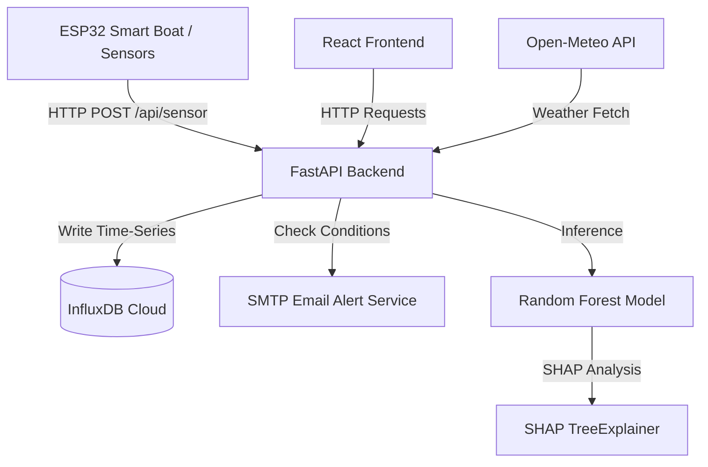

# Smart Pond XAI — Project Documentation & Context

This document provides a comprehensive overview of the **Smart Pond XAI** system. It describes the project architecture, features, directories, database schema, API routes, machine learning training pipeline, and ESP32 firmware details.

---

## 1. Project Overview

**Smart Pond XAI** is an IoT, Machine Learning (ML), and Explainable AI (XAI) assisted Pond Management System. It allows real-time monitoring of pond water parameters (pH, temperature, turbidity), automates fish habitat suitability predictions, explains those predictions locally using SHAP (SHapley Additive exPlanations), handles automated/manual fish feeding, and sends alerts when water quality degrades.

### High-Level Flow


---

## 2. Directory Structure

The project is divided into four main layers/directories:

```
smart-pond-xai/
├── app/                      # FastAPI Backend Application
│   ├── config.py             # Environment configurations and thresholds
│   ├── main.py               # Application entry point, router mounts, startup events
│   ├── models/
│   │   └── schemas.py        # Pydantic schemas for data validation
│   ├── routes/
│   │   ├── dashboard.py      # Dashboard APIs (sensor data + weather, history, status)
│   │   ├── feeding.py        # Manual/Auto feeding trigger and logs
│   │   ├── ota.py            # Firmware Over-The-Air update serving
│   │   ├── prediction.py     # ML prediction and XAI (SHAP) endpoints
│   │   └── sensor.py         # Sensor data ingestion endpoint from ESP32
│   └── services/
│       ├── alert_service.py  # SMTP email alert dispatcher with deduplication
│       ├── influx_service.py # InfluxDB read/write service using Flux queries
│       ├── ml_service.py     # Model loader & predictor (RF, fallback rules)
│       └── shap_service.py   # SHAP explainer generator (TreeExplainer, fallback rules)
├── firmware/
│   └── ESP32_BOAT/           # ESP32 C++ (Arduino) source files
│       ├── ESP32_BOAT.ino    # Main firmware setup and loop
│       ├── bluetooth.h       # BLE configuration for remote navigation
│       ├── config.h          # Wi-Fi credentials, Server endpoints, Pin configs
│       ├── data_sender.h     # HTTP POST sender for transmitting sensor data
│       ├── motors.h          # DC Motor driver settings
│       ├── ota_update.h      # OTA implementation
│       ├── sensors.h         # Analog sensor parsing (DS18B20 Temp, pH, Turbidity)
│       ├── servo_control.h   # Servo steering controls for boat navigation
│       └── wifi_manager.h    # Wi-Fi auto-connect / reconnect logic
├── frontend-react/           # Vite + React Frontend Application
│   ├── src/
│   │   ├── main.jsx          # Entry point
│   │   ├── App.jsx           # Routing configuration
│   │   ├── services/
│   │   │   └── api.js        # API endpoints call wrappers
│   │   ├── components/       # Reusable layout elements (sidebar, datatable, searchbar)
│   │   └── pages/            # View pages (Dashboard, XAI, Feeding, Analytics, etc.)
│   └── package.json          # Frontend dependencies (Recharts, TailwindCSS, etc.)
├── ml/                       # Machine Learning Training Pipeline
│   ├── data/                 # Raw and processed datasets
│   ├── models/               # Serialized models (*.pkl) and scaler
│   ├── notebooks/            # EDA, preprocessing, and training notebooks
│   ├── train.py              # Augmented pipeline training script (RF, DT, SVM)
│   └── predict.py            # CLI prediction script
├── ARCHITECTURE.md           # Deployment & system flow documentation
└── requirements.txt          # Python dependencies list
```

---

## 3. Database Schema (InfluxDB)

InfluxDB stores all time-series data. The measurements, tags, and fields are configured as follows:

| Measurement Name | Tag Keys | Field Keys | Purpose |
| :--- | :--- | :--- | :--- |
| `water_sensor_data` | `pond_id`, `device_id`, `status` | `water_temperature` (float), `ph` (float), `turbidity` (int) | Real-time sensor readings sent by ESP32 |
| `weather_data` | `pond_id` | `air_temperature` (float), `humidity` (float), `rainfall` (float), `wind_speed` (float), `pressure` (float) | Cached localized weather forecasts (Open-Meteo) |
| `water_quality_prediction` | `pond_id`, `model_version` | `quality_class` (string), `confidence_score` (float) | Water classification prediction (GOOD/MODERATE/POOR) |
| `fish_habitat_prediction` | `pond_id`, `model_version` | `habitat_status` (string), `recommended_fish` (string), `confidence_score` (float) | Suggested fish suitability with confidence |
| `xai_explanations` | `pond_id`, `model_version`, `top_feature` | `ph_importance` (float), `temperature_importance` (float), `turbidity_importance` (float), `explanation_type` (string), `interpretation` (string) | SHAP local explanations for inferences |
| `feeding_logs` | `pond_id`, `feeding_mode` | `feeding_status` (string), `duration_seconds` (int), `reason` (string) | Records of manual or automated fish feeding |
| `alerts` | `pond_id`, `alert_type`, `severity` | `message` (string), `resolved` (bool) | System notifications/alerts history |

---

## 4. API Endpoints Reference

### 1. Ingestion (Sensor)
*   `POST /api/sensor`: Receives real-time readings from ESP32.
    *   **Payload:** `{ "temperature": float, "ph": float, "turbidity": int, "status": Optional[str] }`
    *   **Logic:** Auto-calculates status if not provided, writes to InfluxDB, checks thresholds, and fires email alerts if status becomes `POOR` or `MODERATE`.

### 2. Dashboard & History
*   `GET /api/dashboard`: Aggregates latest sensor data and weather forecast.
*   `GET /api/history?hours=N`: Retrieves history of sensor readings from the past `N` hours (max 168 hours).
*   `GET /api/status`: Returns a simplified JSON representation of the latest status.
*   `GET /api/weather?hours=N`: Retrieves history of weather forecasts.
*   `GET /api/predictions?hours=N`: Retrieves history of water quality predictions.
*   `GET /api/alerts?hours=N`: Retrieves history of water quality alerts.
*   `GET /api/xai?hours=N`: Retrieves history of local SHAP explanation features.
*   `GET /api/feeding?hours=N`: Retrieves history of feeding logs (mapped to frontend columns).
*   `GET /api/fish-habitat?hours=N`: Retrieves history of fish habitat recommendations.

### 3. ML Inference & XAI
*   `POST /api/predict`: Returns fish recommendation and SHAP XAI calculations based on manual input.
*   `POST /api/predict/auto`: Automatic prediction triggered using the latest ESP32 sensor values and weather context.
*   `GET /api/predict/latest`: Fetches the last prediction stored in InfluxDB.
*   `GET /api/predict/history?hours=N`: Fetches historical recommendations.

### 4. Feeding Management
*   `POST /api/feed`: Dispatches feeding commands (refuses execution if water status is `POOR`).
*   `GET /api/feed/logs?hours=N`: Logs of past feedings (raw backend representation).
*   `GET /api/feed/status`: Latest feeding status and count for the day.

---

## 5. Machine Learning Pipeline (`ml/`)

1.  **Dataset:** Located in `ml/data/raw/pond_dataset.csv`. Contains unique physical habitat metrics matched to 11 species of fish (e.g., *tilapia*, *rui*, *pangas*).
2.  **Data Augmentation:** The training pipeline in `ml/train.py` implements a **50x Gaussian Noise Augmentation** to upscale the unique dataset into 14,350 training records.
    *   `ph`: Normal noise $\sigma = 0.05$ (clipped to $[0, 14]$)
    *   `temperature`: Normal noise $\sigma = 0.30$ (clipped to $[0, 50]$)
    *   `turbidity`: Normal noise $\sigma = 0.20$ (clipped to $[0, 100]$)
3.  **Models Trained:**
    *   **Random Forest Classifier** (Best accuracy, 85.26%, saved as `rf_model.pkl`)
    *   **Decision Tree Classifier** (saved as `dt_model.pkl`)
    *   **SVM Classifier** (saved as `svm_model.pkl`)
4.  **Feature Scaling:** Standard Scaler is utilized to normalize pH, temperature, and turbidity. It is saved in `scaler.pkl`.
5.  **Explainability:** `TreeExplainer` from `shap` calculates feature contributions for each recommendation, highlighting which parameter (pH, Temp, Turbidity) had the highest impact on the choice.

---

## 6. ESP32 Firmware Implementation (`firmware/`)

*   **Motors & Navigation:** DC Motor controls (`motors.h`) and Servo steering (`servo_control.h`) allow the boat to navigate the pond.
*   **Sensor Ingestion:** Reads water temperature from a DS18B20 probe, turbidity from an analog sensor, and pH via an analog probe, converting voltages to metrics (`sensors.h`).
*   **WIFI Manager:** Features smart auto-connect and reconnect logic to maintain connection (`wifi_manager.h`).
*   **Data Dispatcher:** Sends POST JSON requests periodically to the backend API endpoint (`data_sender.h`).
*   **OTA Updates:** Implements firmware update pulls over the network (`ota_update.h`).

---

## 7. Testing, Simulation & Diagnostics

To facilitate testing without a physical ESP32 device, a simulation utility script has been introduced:

### Sensor Simulator (`simulate_sensor.py`)
This script sends realistic simulated pond data to the local FastAPI backend. It also supports chaining automated ML predictions and mock feeding entries.

*   **Run Single Batch (5 records + predictions + feed):**
    ```bash
    python simulate_sensor.py --batch 5 --predict --feed
    ```
*   **Run Continuous Mode (Saves weather and sensor reading every 10s):**
    ```bash
    python simulate_sensor.py --continuous --interval 10 --predict
    ```
*   **Simulate a Water Degradation Alert:**
    ```bash
    python simulate_sensor.py --status POOR --predict
    ```

### How to Switch back to Real ESP32 Sensors
1.  **Stop the simulator script:** Press `Ctrl+C` in the terminal where `simulate_sensor.py` is running.
2.  **No Code/Config changes needed:** The simulator and the physical ESP32 use the **exact same endpoint** (`POST /api/sensor`). 
3.  As soon as the physical ESP32 is powered on and connected to the same local network, it will begin sending requests to `http://<your-local-ip>:8000/api/sensor`. The backend will transparently accept the real sensor readings, write them to InfluxDB, and the dashboard will update in real-time.

