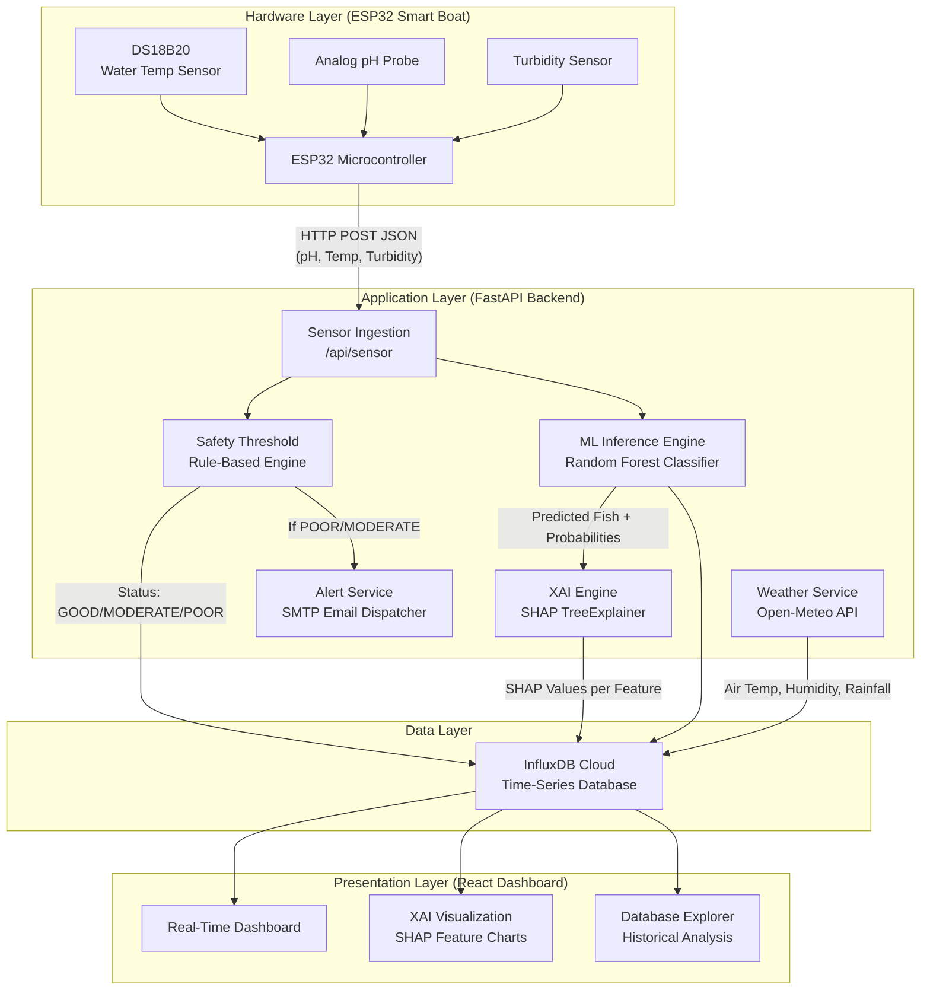
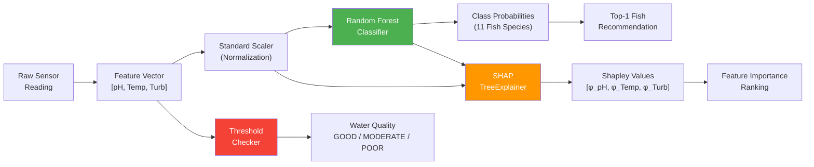

# System Architecture — Diagrams & Descriptions for Paper

This file contains ready-to-use architecture descriptions, data flow diagrams (Mermaid), and table formats that you can adapt directly into your paper's **System Architecture** or **Proposed Methodology** section.

---

## 1. High-Level System Architecture Diagram

Use this diagram in your paper's methodology section. It shows the complete data flow from sensors to the user dashboard.

---

## 2. Data Processing Pipeline Diagram

This focuses specifically on how raw sensor data flows through preprocessing, classification, and explanation.

---

## 3. Hardware Specifications Table

| Component | Specification | Role |
| :--- | :--- | :--- |
| Microcontroller | ESP32 DevKit V1 (240MHz, Dual Core, Wi-Fi + BLE) | Central processing, network communication |
| Temperature Sensor | DS18B20 (Digital, Waterproof, ±0.5°C accuracy) | Measures water temperature |
| pH Sensor | Analog pH Probe (0–14 range, E-201-C electrode) | Measures water acidity/alkalinity |
| Turbidity Sensor | Analog Turbidity Sensor (0–100 NTU range) | Measures water clarity |
| Motor Driver | L298N Dual H-Bridge | DC motor control for boat navigation |
| Servo Motor | SG90 Micro Servo (180° range) | Steering control |
| Power Supply | 3.7V Li-Po Battery (2200mAh) with TP4056 charger | Portable power for the boat |
| Communication | IEEE 802.11 b/g/n (2.4 GHz Wi-Fi) | Data transmission to backend |

---

## 4. Software Stack Table

| Layer | Technology | Version | Purpose |
| :--- | :--- | :--- | :--- |
| Backend Framework | FastAPI (Python) | 0.100+ | REST API server |
| Database | InfluxDB Cloud (v2) | Cloud | Time-series storage |
| ML Framework | scikit-learn | 1.3+ | Model training & inference |
| XAI Library | SHAP | 0.42+ | Shapley value computation |
| Frontend | React.js + Vite | 18+ / 5+ | User interface dashboard |
| Charting | Recharts | 2.x | Data visualization |
| Firmware | Arduino (C++) | ESP32 Core 2.0 | Sensor reading & HTTP POST |
| Weather API | Open-Meteo | Free Tier | External weather context |

---

## 5. InfluxDB Measurement Schema (for Paper's Database Design section)

| Measurement Name | Tags | Fields | Description |
| :--- | :--- | :--- | :--- |
| `water_sensor_data` | `pond_id`, `device_id`, `status` | `ph` (float), `water_temperature` (float), `turbidity` (int) | Raw sensor readings from ESP32 |
| `weather_data` | `pond_id` | `air_temperature` (float), `humidity` (int), `rainfall` (float), `wind_speed` (float), `pressure` (float) | Weather context from Open-Meteo |
| `fish_habitat_prediction` | `pond_id`, `model_version` | `recommended_fish` (str), `confidence_score` (float), `habitat_status` (str), `top3_fish` (str) | ML prediction results |
| `water_quality_prediction` | `pond_id`, `model_version` | `quality_class` (str), `confidence_score` (float), `ph` (float), `temperature` (float), `turbidity` (int) | Water quality classification |
| `xai_explanations` | `pond_id`, `model_version`, `top_feature` | `ph_importance` (float), `temperature_importance` (float), `turbidity_importance` (float), `explanation_type` (str), `interpretation` (str) | SHAP explanation records |
| `feeding_logs` | `pond_id`, `feeding_mode` | `feeding_status` (str), `duration_seconds` (int), `reason` (str) | Feeding event logs |
| `alerts` | `pond_id`, `alert_type`, `severity` | `message` (str), `resolved` (bool) | System alerts |

---

## 6. Water Quality Threshold Rules (for Hybrid Decision Framework section)

| Parameter | GOOD Range | MODERATE Range | POOR Range | Scientific Basis |
| :--- | :--- | :--- | :--- | :--- |
| pH | 6.5 – 8.5 | 5.5 – 6.5 or 8.5 – 9.5 | < 5.5 or > 9.5 | FAO Fisheries Technical Paper No. 44 |
| Water Temperature | 25°C – 32°C | 20°C – 25°C or 32°C – 35°C | < 20°C or > 35°C | Boyd (1998), Tropical aquaculture standards |
| Turbidity | 0 – 30 NTU | 30 – 60 NTU | > 60 NTU | EIFAC guidelines (European Inland Fisheries) |

*Note:* Overall status = `min(pH_status, Temp_status, Turbidity_status)`. If **any** parameter is `POOR`, the overall status is `POOR` regardless of other values.
